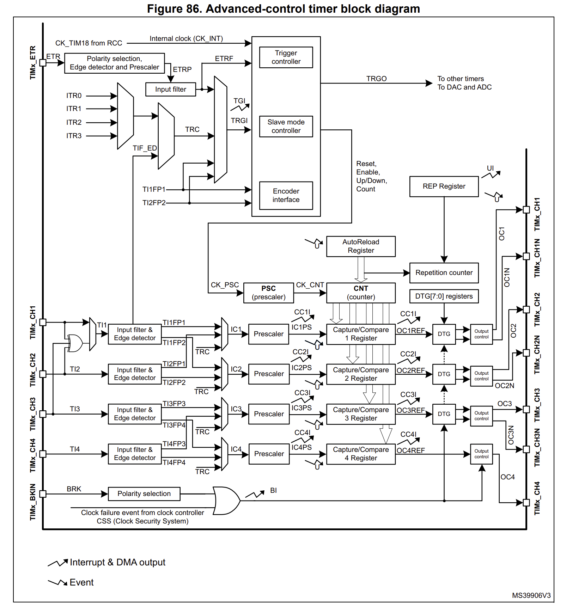

# FOC Module固件开发记录

## 运行参数

### 变量类型

#### 浮点数变量

> [Using STM32 Hardware Floating Point Support – VisualGDB Tutorials](https://visualgdb.com/tutorials/arm/stm32/fpu/#:~:text=STM32F4 floating-point unit only supports 32-bit floating point,a run-time exception. We will demonstrate it now.)
>
> [STM32F4系列，能支持double型的浮点运算吗-CSDN社区](https://bbs.csdn.net/topics/392629095)

STM32F4系列单片机**只有硬件单精度浮点**，**只能用float类型变量**。如果使用较老版本的GCC编译器，同时使用double变量，则会导致运行时错误，GCC 4.9.1以后修复了这个问题。

为了加快浮点数计算效率，所有浮点数变量全部使用float类型。

## PWM

### Counter Mode 计数模式

> [STM32-一文搞懂通用定时器捕获/比较通道_捕获比较通道-CSDN博客](https://blog.csdn.net/wei348144881/article/details/109091539)
>
> [STM32F103高级定时器死区时间的计算_stm32死区生成-CSDN博客](https://blog.csdn.net/geek_monkey/article/details/82809931)

## ADC低侧采样

> [foc配置篇——ADC注入组使用定时器触发采样的配置_定时器控制adc采样-CSDN博客](https://blog.csdn.net/jdhfusk/article/details/126201653)
>
> [STM32 进阶教程 17 - ADC注入通道_stm32 adc注入-CSDN博客](https://blog.csdn.net/zhanglifu3601881/article/details/97613959)

## DAC

> [【STM32】HAL库 ——DAC_stm32 hal dac-CSDN博客](https://blog.csdn.net/Qxiaofei_/article/details/119108963)

## SVPWM

> [关于电机dq轴的理解 - 知乎 (zhihu.com)](https://zhuanlan.zhihu.com/p/641738156)

## DSP

> [STM32F4+CubeMX+Hal库下使能FPU_cubemax fpu加速-CSDN博客](https://blog.csdn.net/jaysur/article/details/108928490)
>
> [STM32 HAL库 CUBEMX FPU 和 DSP库 使用-CSDN博客](https://blog.csdn.net/yuleitao/article/details/105621492)
>
> [STM32 DSP库的快速添加 基于cubemx 调用，使用DSP库_#include "arm_const_structs.h"怎么添加_四臂西瓜的博客-CSDN博客](https://blog.csdn.net/qq_34022877/article/details/117855263)
>
> [如何使用CLion添加STM32F4xx的DSP库 - 哔哩哔哩 (bilibili.com)](https://www.bilibili.com/read/cv19024271/?spm_id_from=333.999.0.0)

## USB虚拟串口收发

> [【精选】【STM32+cubemx】0016 HAL库开发：USB虚拟串口（virtual COM）_hal usb-CSDN博客](https://blog.csdn.net/little_grapes/article/details/121549875)

`CDC_Receive_FS`和`CDC_Transmit_FS`这两个函数就是应用层实现收、发的函数。

发送函数`CDC_Receive_FS`可以直接被用户使用，调用函数，只要传入待发送数据的**首地址**和**数据长度**就可以把数据从USB虚拟串口中发送出去了。

> [STM32 USB使用记录：使用CDC类虚拟串口（VCP）进行通讯_cdc_control_fs函数是用来干什么的_Naisu Xu的博客-CSDN博客](https://blog.csdn.net/Naisu_kun/article/details/118192032)