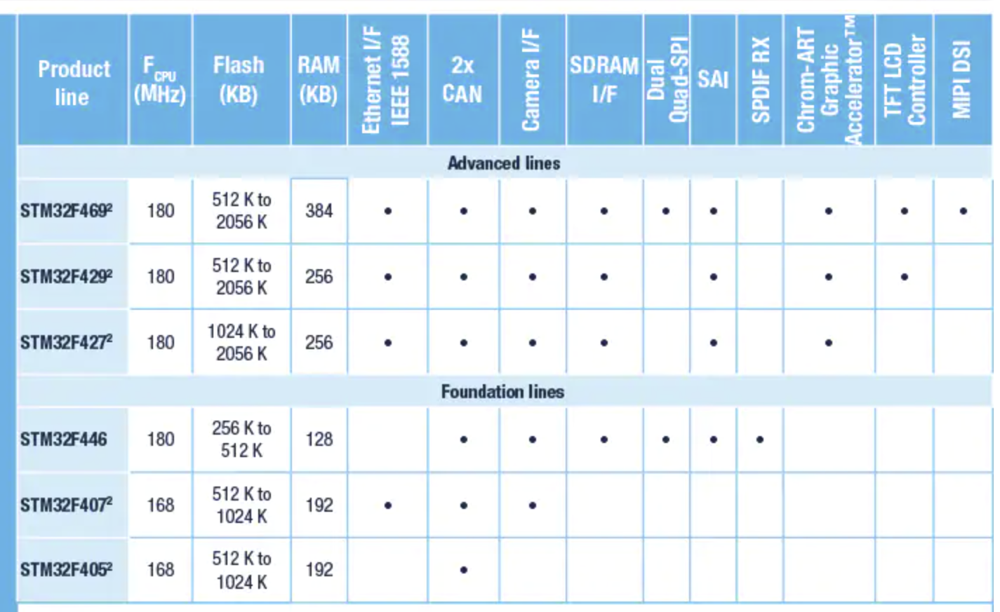

# FOC Module控制器开发记录

## 芯片选型

### MCU

> [STM32F4 系列 - 意法半导体STMicroelectronics](https://www.st.com/zh/microcontrollers-microprocessors/stm32f4-series.html)
>
> [STM32F405/415 - 意法半导体STMicroelectronics](https://www.st.com/zh/microcontrollers-microprocessors/stm32f405-415.html)
>
> [STM32F405RG - 带DSP和FPU的高性能基础系列ARM Cortex-M4 MCU，具有1 MB Flash、168 MHz CPU和ART加速器 - 意法半导体STMicroelectronics](https://www.st.com/zh/microcontrollers-microprocessors/stm32f405rg.html)
>
> 
>
> 在F4系列所有包含CAN的单片机中，STM32F405的价格最低，且CPU频率仍然高达168MHz。
>
> F405与F415区别在于：STM32F415还整合了加密/HASH处理器，为AES 128、192、256、Triple DES和HASH（MD5、SHA-1）实现了硬件加速。电机驱动应用不需要这个外设。
>
> 64-pin足以驱动一路电机。

最终选择STM32F405RGT6。