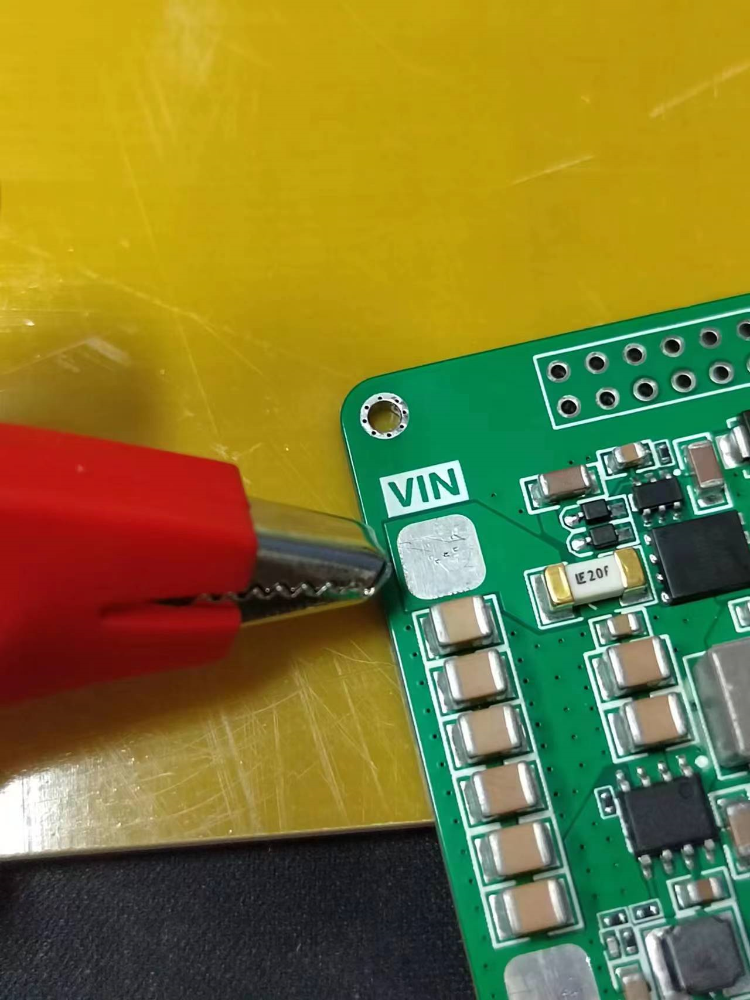
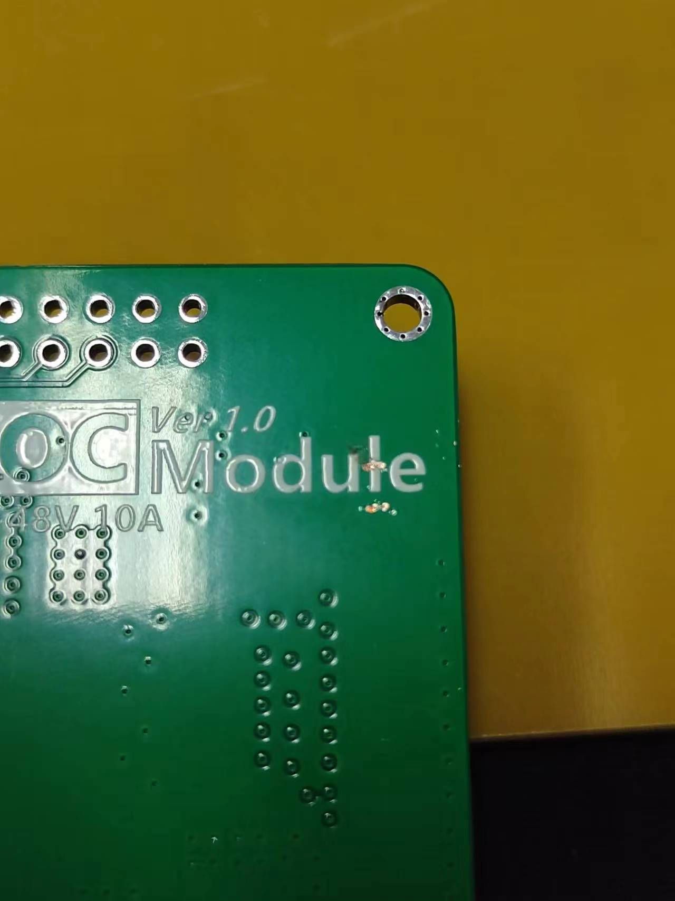

# FOC Module驱动器开发记录

## 硬件调试记录

### 移除电源夹具时冒火花

**原因：	**电源为感性负载，直接拔掉电源会感应出高电压。

**解决方法：	**电源处关闭输出后，再拔掉电源

### VIN处冒火花，然后短路，无法加电压

**原因：**使用夹具供电，正面焊盘为VIN，背面GND铺铜阻焊被夹具刮掉了，导致短路。

**解决方法：**焊盘先焊硅胶线出来，夹具再夹住硅胶线。